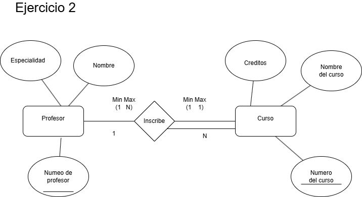
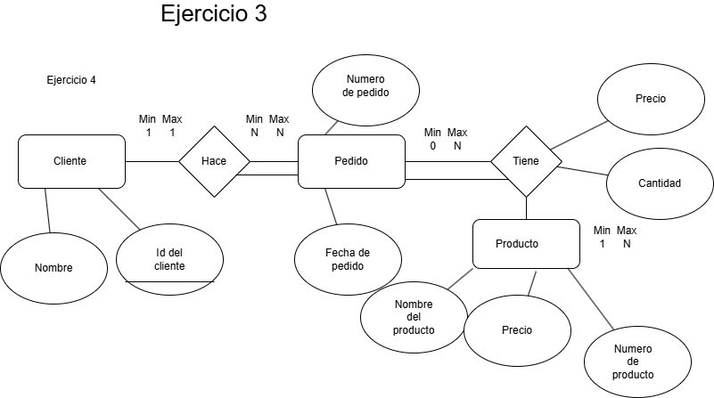
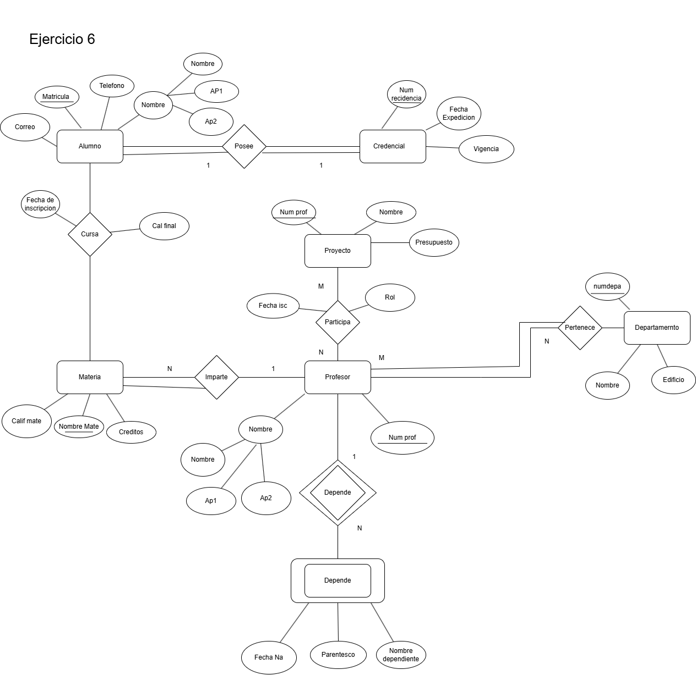

# Ejercicios del modelo entidad relacion 

 
## Ejercicio 1
Un hospital registra información de sus pacientes.
> De cada paciente se almacena lo siguiente:
- Identificador
- Nombre
- Fecha de nacimiento

> De cada expediente médico se debe almacenar:
- Número de expediente.
- Fecha de apertura.
- Tipo de sangre.

> Reglas del negocio:
- Cada paciente debe tener exactamente un expediente médico.
- Cada expediente médico pertenece a un único paciente.
- No puede existir un expediente sin paciente.
- No puede existir un paciente sin expediente.

## Ejercicio 2

U na univerdidad administra profesores y cursos 

>De cada profesor se almacena :

- numero de profesor 
- nombre 
- especialidad

>De cada curso se almacena :

- numero de curso 
- nombre del curso
- creditos 

>Regras del negocio :

1. un profesor puede impartir varios cursos 
2. un curso solamente puede ser impartido por un profesor 
3. puede existir un profesor que actualmente nmo imparte cursos
4. todo curso debe estar asignado a un profesor 

>Lo que se debe realizar :

- identificar y dibujar las entidades 
- identificar y dibujar la relacion **IMPARTE**
- determinar la razon de cardinalidad
- determinar la participacion 

# Ejercicio 3

una escuela administra alumnos y materias 

>de cada alumno se almacedna :

- matricula 
- nombre 
- semestre

>de cada materia se alamacena 

- clave de la materia 
- nombre de la materia 
- creditos

>regras del negocio 

1. un alumno puede inscribirse en varias materias 
2. una  materia puede tener muchos alumnos incritos 
3. puede existir una materia sin alumnos inscritos
4. todo alumno debe estar inscrito en almenos una materia
5. de cada inscripccion se desea almacenar :     

     - fecha de inscripccion 
     - calificacion final 

nota: la relacion se debe llamar 
**inscibe**

## ejercicio 4 

una empresa se dedica a la vejta de productos al por mayor necesita y regitrar lo sig

>de los clientes necesita alamacenar 

- identificador del cliente 
- nombre del cliente , ewl cual es una persona moral 

> de los pedisod sde venta 

- nombre del pedido
- fecha del epdido
 
>de los productos 

- numero del producto 
- nombre del producto 
- precio del producto

> reglas del negocio 

1. un cliente puede realiza rmuchos pedidoios 
2. cada pedido pertenece a un solo cliente 
3. un pedidio contyienen varios productos 
4. un producto puede aparecer en muchos pedidos 
5. un pedido debe contener almenos un producrto 
6. un prodcuto puede no haber sido vendido 
7. el de talle del pedido no existe sin pedido 
8. el detalle del pedido no existe sin producto 
9. el detalle del pediddo almacena cantidad vendida y precio de venta 

 

## EJERCICIO 5

1. The company is organized into departments. Each department has a unique name, a 
unique number, and a particular employee who manages the department.We keep track 
of the start date when that employee began managing the department. A department 
may have several locations. 
2. A department controls a number of projects, each of which has a unique name, a unique 
number, and a single location. 
3. We store each employee's name, Social Security number, address, salary, sex (gender), 
and birth date. An employee is assigned to one department, but may work on several 
projects, which are not necessarily controlled by the same department. We keep track of 
the current number of hours per week that an employee works on each project. We also 
keep track of the direct supervisor of each employee (who is another employee). 
4. We want to keep track of the dependents of each employee for insurance purposes.We 
keep each dependent's first name, sex, birth date, and relationship to the employee. 

## EJERCICIO 6 

1. The company is organized into departments. Each department has a unique name, a 
unique number, and a particular employee who manages the department.We keep track 
of the start date when that employee began managing the department. A department 
may have several locations. 
2. A department controls a number of projects, each of which has a unique name, a unique 
number, and a single location. 
3. We store each employee's name, Social Security number, address, salary, sex (gender), 
and birth date. An employee is assigned to one department, but may work on several 
projects, which are not necessarily controlled by the same department. We keep track of 
the current number of hours per week that an employee works on each project. We also 
keep track of the direct supervisor of each employee (who is another employee). 
4. We want to keep track of the dependents of each employee for insurance purposes.We 
keep each dependent's first name, sex, birth date, and relationship to the employee. 

## EJERCICIO 7

